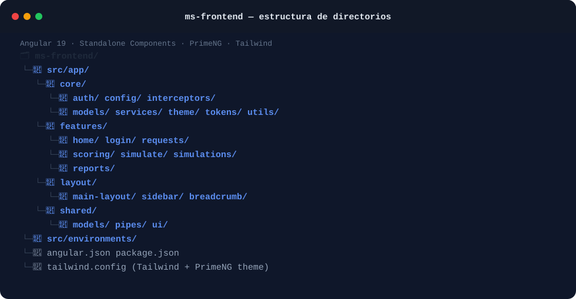

# ms-frontend

**Single-page application (SPA) for the RIntellix credit-risk platform.**

`Angular 19` · `Standalone Components` · `PrimeNG` · `Tailwind CSS` · `Keycloak (OIDC)`

---

## 1. Overview

`ms-frontend` is the web client used by credit-risk
analysts to operate RIntellix end to end: browse credit requests, launch and inspect risk
simulations, review scoring results with their SHAP-based explanation, and download the
generated PDF reports. It talks exclusively to the backend through `ms-sec-gateway`, which
authenticates every request against Keycloak.

## 2. Key aspects of the system

- **Standalone components, no NgModules.** Built with Angular's standalone-component API and
  lazy-loaded routes (`loadComponent` / `loadChildren`), keeping the initial bundle small and
  each feature self-contained.
- **Feature-based structure.** `features/` holds one folder per business capability — `home`,
  `login`, `requests`, `scoring`, `simulate`, `simulations`, `reports` — while `core/` holds
  cross-cutting concerns and `shared/` holds reusable, presentation-only building blocks.
- **Authentication via Keycloak (OIDC).** `core/auth` integrates `keycloak-angular` /
  `keycloak-js`; an `authGuard` protects every route under the main layout, and an HTTP
  interceptor (`core/interceptors`) attaches the access token to outgoing API calls.
- **Server-side pagination with URL synchronization.** List views (requests, simulations) use
  server-side lazy loading — the current page, page size and filters are kept in sync with the
  URL query parameters, and an Angular **Resolver** (`request.resolver.ts`) pre-fetches route
  data before the component renders.
- **Explainability-aware UI.** The `scoring` feature renders the SHAP-based risk drivers
  returned by `ms-model` (via `ms-risk-engine`), represented with a dedicated chart component
  (`ShapDriversChartComponent`, built on Chart.js) so analysts can see *why* a request scored
  the way it did.
- **PrimeNG + Tailwind design system.** UI components come from PrimeNG (themed via
  `@primeng/themes`), utility styling from Tailwind CSS, icons from `lucide-angular`, and
  Lottie animations for empty/loading states.

### Route map (top level)

| Path | Feature | Notes |
|---|---|---|
| `/login` | `login` | Public, outside the authenticated layout |
| `/home` | `home` | Landing dashboard |
| `/requests/**` | `requests` | Lazy-loaded feature routes |
| `/simulations/**` | `simulations` | Lazy-loaded feature routes |
| `/reports` | `reports` | Report listing / download |

### Repository structure

The following schematic illustrates the source code layout and how the key architectural pieces described above map to the main project folders:



## 3. Tech stack

- **Framework:** Angular 19 (standalone components, `zone.js`)
- **UI library:** PrimeNG 19 + PrimeIcons
- **Styling:** Tailwind CSS (`@tailwindcss/postcss`)
- **Charts:** Chart.js
- **Auth:** `keycloak-angular`, `keycloak-js`
- **Icons / motion:** `@lucide/angular`, `ngx-lottie` / `@lottiefiles/dotlottie-web`
- **Testing:** Jasmine + Karma

## 4. Prerequisites

- Node.js (LTS compatible with Angular 19) and npm
- Angular CLI (`npm install -g @angular/cli`, or use `npx ng`)
- `ms-sec-gateway` (and, transitively, the rest of the backend) running and reachable, plus a
  configured Keycloak realm, for the app to authenticate and fetch real data

## 5. Getting started

> [!IMPORTANT]
> **Global platform deployment**
> This repository contains only the web client code. To spin up the entire RIntellix platform (including Keycloak, databases, and the rest of the microservices), clone the main infrastructure repository **[TFG-RIntellix/rintellix-deployment]** and follow its instructions.

The following commands are provided for local development, code review, and testing:

```bash
# 1. Clone the repository
git clone https://github.com/TFG-RIntellix/ms-frontend.git
cd ms-frontend

# 2. Install dependencies
npm install
```

### Build

```bash
npm run build
# production bundle is emitted to dist/
```

### Tests

```bash
npm test
# runs unit tests with Karma
```

## 6. Configuration

Runtime configuration (backend gateway URL, Keycloak realm/client id) is centralised in
`src/app/core/config` and consumed through injection tokens in `core/tokens`. Adjust these
values to point at the deployed infrastructure before running the app against real data.

| Variable/Property | Description | Default |
|---|---|---|
| `gatewayUrl` | Base URL of the backend API Gateway (`ms-sec-gateway`) | `http://localhost:8085` |
| `keycloak.url` | URL of the Keycloak instance for authentication | `http://localhost:8180` |
| `keycloak.realm` | Keycloak realm name | `rintellix` |
| `keycloak.clientId` | OIDC client identifier configured in Keycloak | `rintellix-spa` |

## 7. Related services

- **ms-sec-gateway** — single backend entry point and authentication gateway used by this SPA.
- **ms-core-data**, **ms-risk-engine**, **ms-reporting** — accessed indirectly, through the
  gateway.

## 8. Author

Lucía Fernández Mancebo — TFG *RIntellix*, Universidad de Cantabria.


